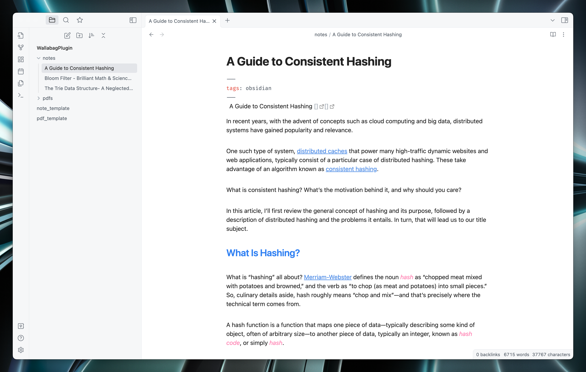
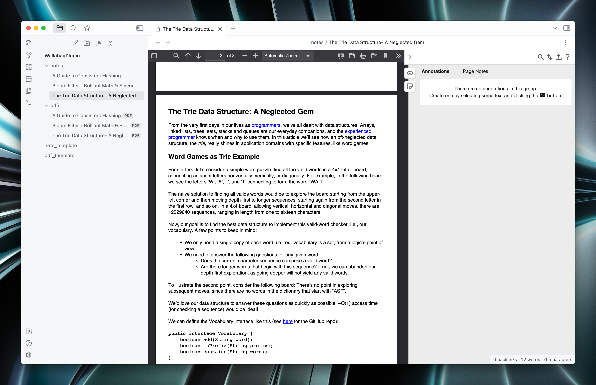

# Obsidian Wallabag Plugin

This plugin for [Obsidian](https://obsidian.md) allows you to sync [Wallabag](https://www.wallabag.it/en) items into Obsidian notes in various ways.

## Authentication

After installing and enabling the plugin first you need to authenticate yourself with your Wallabag instance.
You can follow the Wallabag's [iOS Setup guide](https://doc.wallabag.org/en/apps/ios.html) for obtaining the client attributes.

## Usage

This plugin fulfills a qiute straightforward purpose; it syncs Wallabag articles and creates notes from them in various possible formats.

Use the command "Sync Wallabag Articles" to sync new articles. Plugin will keep a track of items synced so if you delete a created note, it won't be generated again unless you use the command "Clear synced articles cache" to reset the plugin cache. There is also a "Delete note and remove it from synced articles cache" command to remove an individual note from both the file system and synced article cache. This is useful to fetch any changes you made to the note in Wallabag (such as tags and annotations).

There are various settings under the plugin settings you can use to personalize your workflow, here are some important ones:

| Setting                                                | Decsription                                                                                                         |
| :----------------------------------------------------- | :------------------------------------------------------------------------------------------------------------------ |
| Tag to sync                                            | Use this for syncing only the articles tagged with tag. If empty plugin will sync all the articles.                 |
| Article Notes Folder                                   | Define the folder you want synced notes will be created. If empty notes will be created at the vault root.          |
| Article Note Template                                  | Use to pass a custom template for notes. See the [Templating](#templating) for more details.                        |
| Sync on startup                                        | If enabled, articles will be synced on startup.                                                                     |
| Sync archived articles                                 | If enabled, archived articles will be synced                                                                        |
| Export as PDF                                          | If enabled synced articles will be exported as PDFs.                                                                |
| Convert HTML Content extracted by Wallabag to Markdown | If enabled the content of the Wallabag article will be converted to markdown before being used for the new article. |
| Archive article after sync                             | If enabled the article will be archived after being synced.                                                         |
| Add article ID in the title                            | If enabled the article ID will be added to title.                                                                   |
| Tag format                                             | Determines how the tags will be populated in the created not. CSV(tag1, tag2) or hashtags(#tag1 #tag2)              |

## Templating

By default this plugin offers two builtin templates; one for inserting the content of the article as a note and one for creating a note with a link to the exported PDF, when the option is enabled. Both the templates include link to the original articles, a link to the Wallabag item and tags. See the example below:



You can use a custom template, in that case plugin will pass the following variables.
| Variable | Description |
|:----------------|:-------------------------------------------------------------------------------------------------------------------|
| `id` | Wallabag ID of the article <sub><br>Add this to your notes frontmatter using the `wallabag_id` key to make use of the 'Delete note and remove it from synced articles cache' command. </sub> |
| `article_title` | Title of the article |
| `original_link` | Link to the source article |
| `created_at` | Creation date of the article in Wallabag |
| `published_at` | When the article was originally published according to Wallabag |
| `updated_at` | Last modification date of the article in Wallabag RemoveCurrentFromSyncedArticlesCacheCommand |
| `wallabag_link` | Link to the article in Wallabag |
| `content` | HTML content extracted by wallabag |
| `pdf_link` | An Obsidian wikilink to the exported pdf file. <sub><br> Only populated if the PDF export option is choosen.</sub> |
| `tags` | Tags attached to the Wallabag article, format depends on the setting |
| `reading_time` | Reading time of the article |
| `preview_picture` | link to preview picture of the article |
| `domain_name` | Link to the source domain article |

I mainly use the template to export pdfs and use [Annotator]() to read using the following template.

```
---
annotation-target: {{pdf_link}}
---
```



## Installation

### Manually

- You need Obsidian v1.0.0+ for latest version of plugin.
- Get the [Latest release of the plugin](https://github.com/huseyz/obsidian-wallabag/releases/latest).
- Create a directory for the plugin under you plugins folder, e.g. `[VAULT]/.obsidian/plugins/obsidian-wallabag`.
- Put the release files under that folder.
- Reload Obsidian.
- Make sure Safe Mode is off and the plugins is enabled.

## Development

### Workflow

- `npm install`.
- `npm run build`.
- Copy `main.js` and `manifest.json` (if changed) to your obsidian vault's plugin folder (e.g. `[VAULT]/.obsidian/plugins/obsidian-wallabag`).
- Disable and re-enable the plugin in Obsidian's settings to reload it.

### State

Relative to `[VAULT]/.obsidian/plugins/obsidian-wallabag`:

- `.synced`: List of all id's that have already been downloaded. Plugin will not attempt to download these articles again until cleared.
- `.__wallabag_token__`: Authentication credentials for Wallabag.

